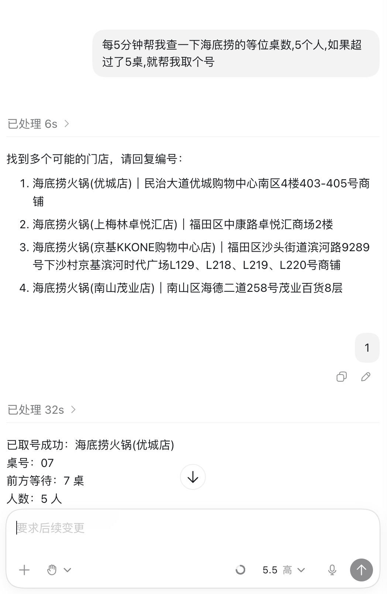

<div align="center">

# 大众点评取号 Skill

完全模拟用户手工操作的自动化浏览器取号 skill，流程完全合规。

大众点评前端页面经常更新；请收藏该 skill，如果未来变得不可用，请联系作者更新并获取最新版本。

[](LICENSE)


</div>

这个 skill 面向中文用户，用于让 agent 辅助处理大众点评排队取号相关任务。为避免脚本被不良商贩滥用，公开仓库只包含 skill 外壳和安装入口，核心浏览器自动化逻辑由闭源 helper 提供。

## 使用场景

1. **定时取号**  
   让 agent 在指定时间自动打开取号页，并按页面流程取号。

2. **定时查看已排桌数，达到条件再取号**  
   让 agent 按用户指定的频率查看当前排队状态；未达到用户设定阈值时不打扰，达到后自动进入取号流程。

3. **取号成功后持续刷新桌数，到点提醒出发**  
   取号成功后，让 agent 按用户指定的频率查看前方等待桌数；当桌数下降到用户设定值时，提醒用户可以出发。

> **重要：对于第一次取号的店铺，建议直接发送大众点评分享链接。**  
> 这样可以跳过浏览器搜索步骤，直接获取店铺 ID，省下不必要的 token 消耗。已经取过号的店铺会写入本地缓存，之后可以直接报店铺名。

<table>
  <tr>
    <td width="33%" align="center">
      
    </td>
    <td width="33%" align="center">
      
    </td>
    <td width="33%" align="center">
      
    </td>
  </tr>
  <tr>
    <td align="center">首次安装配置手机和城市</td>
    <td align="center">首次取号需使用短信验证码登录</td>
    <td align="center">设定触发条件的动态取号场景</td>
  </tr>
</table>

## 安装

```bash
python3 scripts/setup_runtime.py
```

本地桌面用户默认只需要配置手机号。浏览器连接、持久化会话和 helper 更新由 skill 自动处理。

## 环境要求

- macOS 或 Ubuntu/Linux。
- 推荐使用自己的本地电脑和常用浏览器环境。
- Ubuntu/Linux 技术上可运行；但 VPS、云服务器、全新浏览器环境可能触发平台登录风控，提示“请使用常用设备登录”，因此不保证可用。
- 可用的本地 Chrome，或服务器环境中的 Playwright Chromium。
- 可接收短信验证码的手机号。
- Windows 暂不作为目标环境。

## 更新

```bash
git pull
python3 scripts/setup_runtime.py
```

`setup_runtime.py` 会根据 `helper-manifest.json` 检查 helper 版本并下载对应平台的最新文件。

## 使用边界与免责声明

本项目仅用于个人在真实账号、真实浏览器环境下，辅助完成大众点评 Web 页面中可访问的排队信息查询与取号流程。

本项目遵循以下使用边界：

- 仅面向真实用户的个人自用场景。
- 仅使用用户本人账号的正常登录态。
- 仅使用浏览器在用户授权后获取的真实信息。
- 不支持手动指定、伪造、模拟或覆盖地理位置。
- 不支持绕过店铺距离限制、登录验证、短信验证、验证码或平台风控。
- 不支持批量取号、多账号取号、代取号、抢号、刷号或任何商业化使用。
- 当页面提示需要到店附近、距离过远、排队关闭、无需排队、商家暂停取号或需要人工验证时，工具会停止自动流程并返回相应提示。

本项目不是大众点评官方工具，也未获得相关平台授权。用户在使用本项目时，应自行遵守大众点评及相关商家的服务规则、排队规则与账号使用规范。因用户违反平台规则、商家规则或法律法规所产生的账号限制、取号失败、风控、封禁、纠纷或其他后果，均由用户自行承担。

本项目作者不鼓励、不支持、也不对任何规避平台规则、影响商家正常经营秩序或损害其他用户公平排队权益的使用方式负责。

## 授权说明

本项目允许个人安装和自用，但不允许复制改发、商用、托管服务、训练数据集使用或二次分发；使用前请阅读 [LICENSE](LICENSE)。
